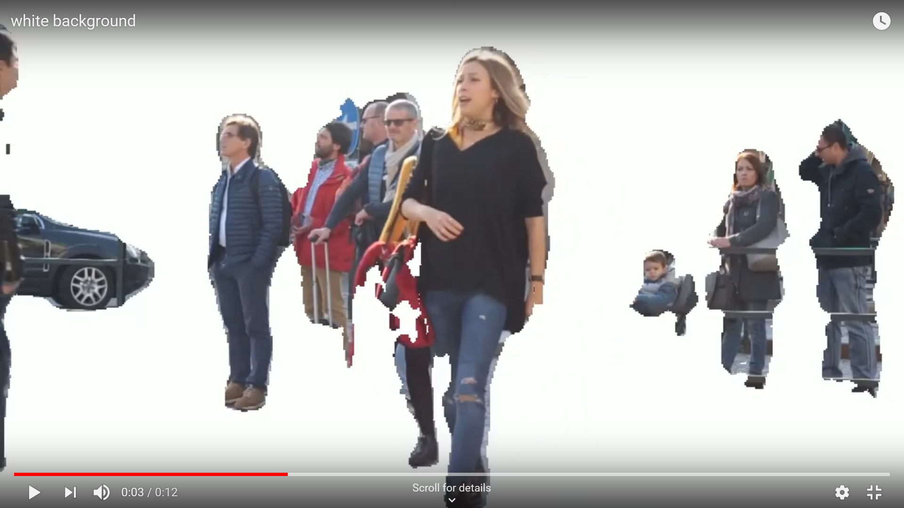
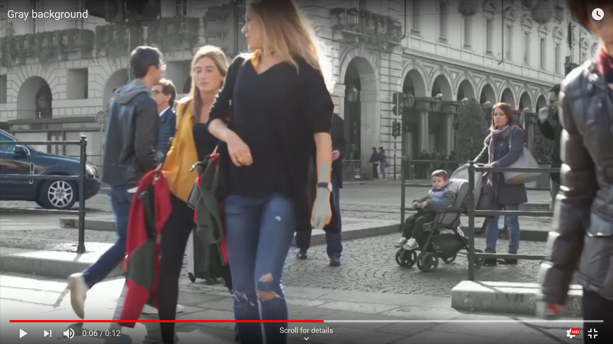

# Alter Video Background

[Blur Video Background](#Blur-Video-Background)

[Blur the Background of Camera's Feeds](#Blur-the-Background-of-Camera's-Feeds)

[Color Video Background](#Color-Video-Background)

[Color the Background of Camera's Feeds](#Color-the-Background-of-Camera's-Feeds)

[Grayscale Video Background](#Grayscale-Video-Background)

[Grayscale the Background of Camera's Feeds](#Grayscale-the-Background-of-Camera's-Feeds)


## Blur Video Background

Blur the background of a video with five lines of code.

**sample_video**
[](https://www.youtube.com/watch?v=8fkthbwqmB0)


```python
import pixellib
from pixellib.tune_bg import alter_bg

change_bg = alter_bg()
change_bg.load_pascalvoc_model("deeplabv3_xception_tf_dim_ordering_tf_kernels.h5")
change_bg.blur_video("sample_video.mp4", moderate = True, frames_per_second=15, output_video_name="blur_video.mp4")
```

**Line 1-4**: We imported pixellib and from pixellib we imported in the class *alter_bg*. Instance of the class is created and we finally loaded the deeplabv3+ model. Download deeplabv3+ pascalvoc model from [here](https://github.com/ayoolaolafenwa/PixelLib/releases/download/1.1/deeplabv3_xception_tf_dim_ordering_tf_kernels.h5)

There are three parameters that control the degree in which the background is blurred.

*low:* When it is set to true the background is blurred slightly.

*moderate:* When it is set to true the background is moderately blurred.

*extreme:* When it is set to true the background is deeply blurred.

```python
change_bg.blur_video("sample_video.mp4", moderate = True, frames_per_second=15, output_video_name="blur_video.mp4")
```

This is the line of code that blurs the video's background. This function takes in four parameters:

**video_path:** the path to the video file we want to blur.

**moderate:** it is set to true and the background of the video would be moderatly blurred.

**frames_per_second:** this is the parameter to set the number of frames per second for the output video file. In this case it is set to 15 i.e the saved video file will have 15 frames per second.

**output_video_name:** the saved video. The output video will be saved in your current working directory.

**Output Video**
[](https://www.youtube.com/watch?v=fzHJwckJTc4)


## Blur the Background of Camera's Feeds

```python
import pixellib
from pixellib.tune_bg import alter_bg
import cv2


capture = cv2.VideoCapture(0)
change_bg = alter_bg()
change_bg.load_pascalvoc_model("deeplabv3_xception_tf_dim_ordering_tf_kernels.h5")
change_bg.blur_camera(capture, frames_per_second=15,moderate = True, show_frames = True, frame_name = "frame", check_fps = True,
output_video_name="output_video.mp4")
```

```python

  import cv2
  capture = cv2.VideoCapture(0)
```
We imported cv2 and included the code to capture camera frames.

```python

  change_bg.blur_camera(capture, moderate = True, frames_per_second= 15, output_video_name="output_video.mp4", show_frames= True,frame_name= "frame", check_fps = True)  
```

In the code for blurring camera's frames, we replaced the video filepath to capture i.e we are going to process a stream of camera frames instead of a video file.We added extra parameters for the purpose of showing the camera frames:

**show_frames:** this parameter handles showing of segmented camera frames and press q to exist.
**frame_name:** this is the name given to the shown camera's frame.

**check_fps:** You may want to check the number of fames processed, just set the parameter check_fps is true.It will print out the number of frames per seconds. In this case it is 30 frames per second.


## Color Video Background

```python
import pixellib
from pixellib.tune_bg import alter_bg

change_bg = alter_bg()
change_bg.load_pascalvoc_model("deeplabv3_xception_tf_dim_ordering_tf_kernels.h5")
change_bg.color_video("sample_video.mp4", colors =  (255, 255, 255), frames_per_second=15, output_video_name="output_video.mp4")
```

```python
change_bg.color_video("sample_video.mp4", colors =  (255, 255, 255), frames_per_second=15, output_video_name="output_video.mp4")
```

It is still the same code except we called the function *color_video* to give the video's background a distinct color. The function *color_bg* takes the parameter *colors* and we provided the RGB value of the color we want to use. We want the image to have a white background and the color's RGB value is set to white which is (255, 255, 255).    

**Output Video**

[](https://www.youtube.com/watch?v=EoG00wQ4MYc)

## Color the Background of Camera's Feeds

``` python
import pixellib
from pixellib.tune_bg import alter_bg
import cv2

capture = cv2.VideoCapture(0)
change_bg = alter_bg()
change_bg.load_pascalvoc_model("deeplabv3_xception_tf_dim_ordering_tf_kernels.h5")
change_bg.color_camera(capture, frames_per_second=15,colors = (255, 255, 255), show_frames = True, frame_name = "frame", check_fps = True,
output_video_name="output_video.mp4")
```

``` python
change_bg.color_camera(capture, frames_per_second=15,colors = (255, 255, 255), show_frames = True, frame_name = "frame", check_fps = True,
output_video_name="output_video.mp4")
```

It is similar to the code we used to blur camera's frames. The only difference is that we called the function *color_camera*. We performed the same routine, replaced the video filepath to capture and added the same parameters. 


## Grayscale Video Background

``` python
import pixellib
from pixellib.tune_bg import alter_bg

change_bg = alter_bg()
change_bg.load_pascalvoc_model("deeplabv3_xception_tf_dim_ordering_tf_kernels.h5")
change_bg.gray_video("sample_video.mp4", frames_per_second=15, output_video_name="output_video.mp4")
```

``` python
change_bg.gray_video("sample_video.mp4", frames_per_second=15, output_video_name="output_video.mp4")
```

We are still using the same code but called a different function *gray_video* to grayscale the background of the video.


**Output Video**

[](https://www.youtube.com/watch?v=NUa2L6skk0I)


## Grayscale the Background of Camera's Feeds

``` python
import pixellib
from pixellib.tune_bg import alter_bg
import cv2

capture = cv2.VideoCapture(0)
change_bg = alter_bg()
change_bg.load_pascalvoc_model("deeplabv3_xception_tf_dim_ordering_tf_kernels.h5")
change_bg.gray_camera(capture, frames_per_second=15, show_frames = True, frame_name = "Ayo", check_fps = True,
output_video_name="output_video.mp4")
```
It is similar to the code we used to color camera's frames. The only difference is that we called the function *gray_camera*. We performed the same routine, replaced the video filepath to capture and added the same parameters. 


